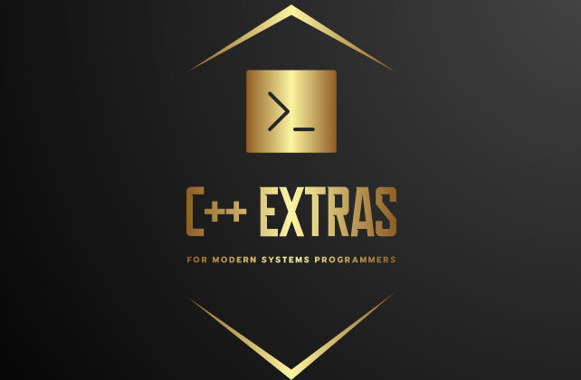

#   perriera/extras
This is a collection of C++ based tools to simplify the software development process. Among the many nifty tools that have been added here is the **extras/interfaces.hpp** file that adds the pseudo keyword '**interface**' to support C++ frameworks.  

  
   

> 
>*Why would someone want to use this?*
>

Being able to use the **'interface'** keyword allows C++ developers to specify the interface of a class before actually implementing it. To an experienced C++ developer, (especially one well versed in the use of the **'interface'** keywords in other languages), this greatly simplifies the C++ software developers task by outlining in advance what the class, (to be developed) has to accomplish.
>
Also, in the case of someone writing C++ code and they need a little **'extra'** help this collection of C++ libraries can make the C++ programming experience a lot easier, (and more enjoyable). At present there is **'extras support'** for  CRC calculations, pseudo C++ keywords, command line options, standard string manipulation and interface drive programming, (GoF Abstract Factory Pattern).
>

	#include <extras/interfaces.hpp>
	#include <extras/exceptions.hpp>
	#include <extras/strings.hpp>
	
>
> Presently supporting Linux platforms is portable to Android, iPhone, iOS, Windows environments.
>
# How to use perriera/extras
There are TWO ways to include perriera/extras into your application. For brand new C++ projects see **perriera/cpp_starter installation** section below. For information on Shared Library support and Ubuntu PPA support see INSTALL.md. For currently existing projects read the **CPM installation** section below on how to add CPM support inside your CMakeLists.txt. 

## perriera/cpp_starter installation
If you have the option of starting a new C++ project, (for the purposes of using **perriera/extras** or **perriera/extras_rsi**), you can use the [perriera/cpp_starter](https://github.com/perriera/cpp_starter) template. 

## CPM installation
Add the following to your CMakeLists.txt for CPM support. CPM support allows you to distribute your packages with other git repositories automatically downloaded, (for the users of your software). In the case of setting up distributed Debian packages, this is advantageous. As you will not be needed to do any other installation steps to be able to incorporate **perriera/extras** into your C++ framework, (on github or otherwise). 

> NOTE: Include 3rd party libraries, Perry and I maintain an open-source extras C++ library, which
	is used extensively in our projects, it comes bundled with spdlog, cpr, and nlohmann json. extras has
	project options that allow us to control how other libraries it includes are built. for example we
	can tell extras to build spdlog as a static library (for faster compile times) by settings
	MAKE_SPDLOG_SHARED OFF
	
To be able to use [CPM](https://github.com/cpm-cmake/CPM.cmake) in your CMakeLists.txt you will need to be using cmake version 3.2.1, (or better); 

	cmake_minimum_required(VERSION 3.21)

Include CPM.cmake https://github.com/cpm-cmake/CPM.cmake

	include(cmake/CPM.cmake)
	include(cmake/utils.cmake)
	include(CMakeDependentOption)
	include(CheckIPOSupported)

Then in your CMakeLists.txt

	CPMAddPackage(
	  NAME extras
	  GITHUB_REPOSITORY perriera/extras
	  VERSION 5.0.8
	  OPTIONS "MAKE_SPDLOG_SHARED OFF"
	  OPTIONS "MAKE_EXTRAS_LIBRARY_ONLY ON"
	)
	if(extras_ADDED)
	  #
	  # NOTE:  enable c++11 to avoid compilation errors, and force spdlog into release build
	  #
	  print(STATUS "Configuring extras build properties")
	  set_target_properties(extras PROPERTIES CMAKE_BUILD_TYPE Release)
	else()
	  print(WARNING "extras was not configured properly")
	endif()

Once this is added to your CMakeLists.txt, the header files of *perriera/extras** will be available to both your compiler environment and perhaps your editor's lint software. You might want to take a look at CMakeLists.txt used here for more details on how to properly use CPM. 

> Note: Just be sure to have the desired **VERSION** of perrier/extras specified in the **VERSION** keyword of the CPMAddPackage specification. Also, to optimize CPM support on your projects be sure to set the CPM_SOURCE_CACHE environment variable for shared CPM libraries. Typically you would add this to your `.bashrc` script. With this environment variable set, the CPM package manager will not need to reload after successive build/ directory resets, (aka. `rm -rf build`). 

	export CPM_SOURCE_CACHE=$HOME/.cache/CPM

## Visual Studio Code (build/ directory) Compilation Fail Safe
The industry practice of compiling to a build/ directory is supported here. When you detect some funny business going on with your development environment, (for example if the cmake utility keeps rebuilding everything), merely delete the build/ directory, (aka. `rm -rf build`) and recreate it. If you are using the Visual Studio Code environment you can press **SHIFT-CTRL-B**, (see `.vscode/tasks.conf`) which will force a rebuild of the directory, (including re-creating `build/` for you).

> Please note: At present whenever you re-open your project with Visual Studio Code the cmake utility may or may not be in sync with the projects, (you'll notice this when all the source files keep getting rebuilt). To correct this open a Terminal window **inside** the Visual Studio Code environment and delete the build/ directory, (aka. `rm -rf build`)then rebuild the project with **SHIFT-CTRL-B**.